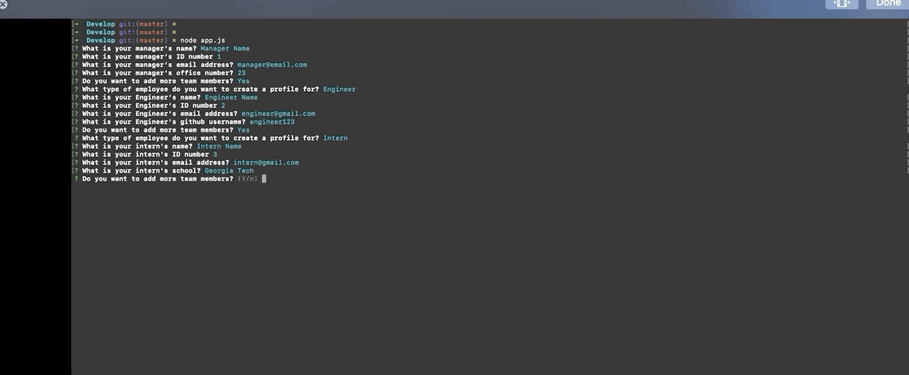
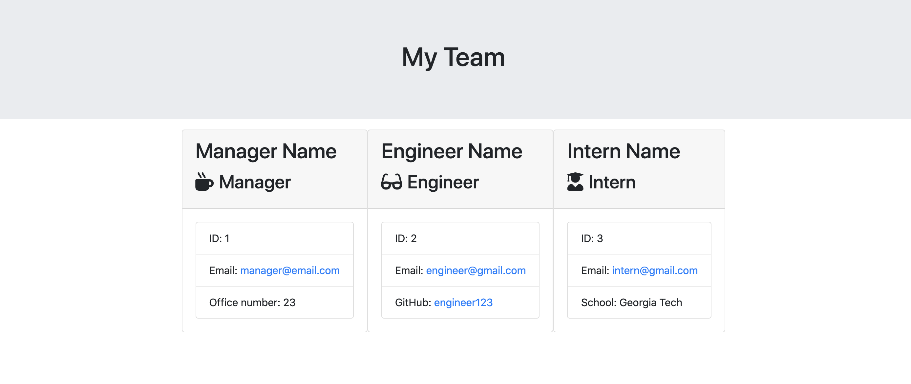

  
# Team Profile Generator

## Description
The team profile generator is a command line application.  The application will prompt the user for information about the team manager and then information about the team members. The user can input any number of team members, and they may be a mix of engineers and interns. When the user has completed building the team, the application will create an HTML file that displays a nicely formatted team roster based on the information provided by the user.

## Table of Contents 
* [Installation](#installation)
* [Usage](#usage)
* [Credits](#credits)
* [MIT License](#MIT-License)
* [Contributing](#Contributing)

## Installation
Clone the repository to your local machine.  Open you command line and navigate to the folder containing the repo.  Once you are there,go to the develop folder.  Once in there, type "node app.js". This will take you through the questions necessary to build your team's profile. Once it is done, go to the output folder and you will see an HTML file named "team.html".  Open it and you will see the results! 

## Usage 

You can use this to generate a team profile within minutes.

## Test Instructions

You can test the classes created for you and the tests are included. It passed all tests prior to uploading so you won't need to do any additional testing.

## MIT License

This project is licensed under the MIT license.

## Contributing

No collaboration at this moment, but feel free to add more to it!

## Questions

If you have any questions please direct them to my email address: diegocordoba@gmail.com or contact me via GitHub here: 
https://github.com/diegocordoba87
 
